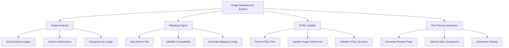
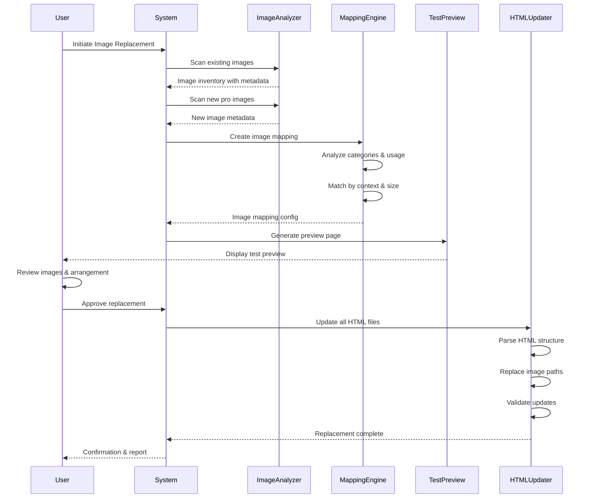

# Design Document: Website Image Replacement

## Overview

This feature enables systematic replacement of all existing images on the Purdue educational website with new professional images from the "pro images" folder. The system provides a test-before-replace workflow that allows preview and validation of new images before committing to full replacement. The design ensures proper image sizing, aspect ratio preservation, responsive design maintenance, and automatic HTML reference updates across all pages.

The feature addresses the challenge of bulk image replacement in a multi-page static website while maintaining visual consistency, responsive behavior, and proper arrangement within existing container elements.

## Architecture



## Main Algorithm/Workflow




## Components and Interfaces

### Component 1: ImageAnalyzer

**Purpose**: Scans and analyzes both existing and new images to extract metadata including dimensions, file size, format, and usage context.

**Interface**:
```typescript
interface ImageAnalyzer {
  scanDirectory(path: string): Promise<ImageInventory>
  analyzeImage(imagePath: string): Promise<ImageMetadata>
  categorizeByUsage(images: ImageMetadata[]): ImageCategoryMap
  getDimensions(imagePath: string): Promise<Dimensions>
}

interface ImageMetadata {
  path: string
  filename: string
  width: number
  height: number
  aspectRatio: number
  fileSize: number
  format: string
  usageContext: ImageUsageContext[]
}

interface ImageInventory {
  images: ImageMetadata[]
  categorized: ImageCategoryMap
  totalCount: number
  byFormat: Map<string, ImageMetadata[]>
}
```

**Responsibilities**:
- Scan file system directories for images
- Extract image dimensions and metadata
- Categorize images by usage context (logo, banner, course, team, etc.)
- Calculate aspect ratios for compatibility matching


### Component 2: MappingEngine

**Purpose**: Creates intelligent mappings between new professional images and existing images based on context, dimensions, and usage patterns.

**Interface**:
```typescript
interface MappingEngine {
  createMapping(
    existingImages: ImageInventory,
    newImages: ImageInventory
  ): Promise<ImageMapping>
  
  validateMapping(mapping: ImageMapping): ValidationResult
  
  suggestAlternatives(
    oldImage: ImageMetadata,
    candidates: ImageMetadata[]
  ): ImageMetadata[]
  
  exportMapping(mapping: ImageMapping): MappingConfig
}

interface ImageMapping {
  mappings: Map<string, string> // oldPath -> newPath
  confidence: Map<string, number>
  alternatives: Map<string, string[]>
  unmapped: string[]
}

interface MappingConfig {
  version: string
  timestamp: string
  mappings: MappingEntry[]
  metadata: MappingMetadata
}

interface MappingEntry {
  oldPath: string
  newPath: string
  category: string
  confidence: number
  reason: string
}
```

**Responsibilities**:
- Match new images to existing images based on context
- Calculate confidence scores for mappings
- Provide alternative suggestions for low-confidence mappings
- Handle cases where new images don't match existing categories
- Export mapping configuration for review and modification


### Component 3: HTMLUpdater

**Purpose**: Parses HTML files, updates image references, and validates the resulting structure to ensure proper functionality.

**Interface**:
```typescript
interface HTMLUpdater {
  parseHTMLFile(filePath: string): Promise<HTMLDocument>
  
  findImageReferences(doc: HTMLDocument): ImageReference[]
  
  updateImageReferences(
    doc: HTMLDocument,
    mapping: ImageMapping
  ): Promise<UpdateResult>
  
  validateHTML(doc: HTMLDocument): ValidationResult
  
  saveHTMLFile(doc: HTMLDocument, filePath: string): Promise<void>
  
  batchUpdateFiles(
    files: string[],
    mapping: ImageMapping
  ): Promise<BatchUpdateResult>
}

interface ImageReference {
  element: string // 'img', 'div', etc.
  attribute: string // 'src', 'style', etc.
  originalPath: string
  line: number
  column: number
  context: string
}

interface UpdateResult {
  updatedReferences: number
  skippedReferences: number
  errors: UpdateError[]
  success: boolean
}

interface BatchUpdateResult {
  filesProcessed: number
  totalReferences: number
  successfulUpdates: number
  errors: BatchUpdateError[]
  report: UpdateReport
}
```

**Responsibilities**:
- Parse HTML files and extract DOM structure
- Locate all image references (img tags, background images, etc.)
- Update image paths according to mapping configuration
- Preserve HTML structure and formatting
- Validate HTML after updates
- Generate detailed update reports


### Component 4: TestPreviewGenerator

**Purpose**: Creates an interactive preview page for users to test and validate new images before committing to full replacement.

**Interface**:
```typescript
interface TestPreviewGenerator {
  generatePreview(mapping: ImageMapping): Promise<PreviewPage>
  
  createComparisonView(
    oldImage: ImageMetadata,
    newImage: ImageMetadata
  ): ComparisonHTML
  
  renderPreviewPage(comparisons: ComparisonHTML[]): string
  
  savePreview(previewHTML: string, outputPath: string): Promise<void>
}

interface PreviewPage {
  htmlContent: string
  cssContent: string
  jsContent: string
  comparisons: ImageComparison[]
}

interface ImageComparison {
  category: string
  oldImagePath: string
  newImagePath: string
  oldDimensions: Dimensions
  newDimensions: Dimensions
  confidence: number
  notes: string[]
}

interface ComparisonHTML {
  html: string
  category: string
  requiresAttention: boolean
}
```

**Responsibilities**:
- Generate side-by-side comparison views
- Display dimension information and aspect ratio differences
- Highlight potential layout issues
- Provide interactive toggle between old and new images
- Generate standalone HTML preview file


## Data Models

### Model 1: ImageMetadata

```typescript
interface ImageMetadata {
  path: string              // Absolute file path
  filename: string          // Base filename with extension
  width: number            // Width in pixels
  height: number           // Height in pixels
  aspectRatio: number      // width / height
  fileSize: number         // Size in bytes
  format: string           // 'jpg', 'png', 'jpeg', 'svg'
  usageContext: ImageUsageContext[]  // Where image is used
  category: ImageCategory  // Categorized type
  lastModified: Date       // File modification timestamp
}

enum ImageCategory {
  LOGO = 'logo',
  BANNER = 'banner',
  COURSE = 'course',
  TEAM = 'team',
  BLOG = 'blog',
  SHOP = 'shop',
  EVENT = 'event',
  CATEGORY = 'category',
  GENERAL = 'general',
  ICON = 'icon'
}

interface ImageUsageContext {
  htmlFile: string
  elementType: string
  cssSelector: string
  containerDimensions?: Dimensions
}

interface Dimensions {
  width: number
  height: number
  unit: 'px' | '%' | 'vw' | 'vh'
}
```

**Validation Rules**:
- path must be absolute and exist on filesystem
- filename must have valid image extension
- width and height must be positive integers
- aspectRatio must be positive number
- format must be one of: 'jpg', 'jpeg', 'png', 'svg', 'gif', 'webp'
- usageContext array can be empty for unused images


### Model 2: ImageMapping

```typescript
interface ImageMapping {
  mappings: Map<string, string>        // oldPath -> newPath
  confidence: Map<string, number>      // oldPath -> confidence (0-1)
  alternatives: Map<string, string[]>  // oldPath -> alternative newPaths
  unmapped: string[]                   // Old paths with no mapping
  metadata: MappingMetadata
}

interface MappingMetadata {
  createdAt: Date
  version: string
  totalMappings: number
  highConfidence: number    // Count of mappings with confidence > 0.8
  mediumConfidence: number  // Count of mappings with 0.5 < confidence <= 0.8
  lowConfidence: number     // Count of mappings with confidence <= 0.5
  unmappedCount: number
  algorithm: string         // Name of mapping algorithm used
}

interface MappingStrategy {
  name: string
  priority: number
  match(old: ImageMetadata, new: ImageMetadata): number  // Returns confidence
}
```

**Validation Rules**:
- All keys in mappings must correspond to existing old image paths
- All values in mappings must correspond to existing new image paths
- Confidence values must be between 0 and 1
- unmapped must only contain paths not in mappings keys
- Sum of highConfidence, mediumConfidence, lowConfidence must equal totalMappings


### Model 3: ReplacementConfig

```typescript
interface ReplacementConfig {
  projectRoot: string
  existingImagesPath: string
  newImagesPath: string
  htmlFiles: string[]
  backupEnabled: boolean
  backupPath?: string
  dryRun: boolean
  imageMappingFile?: string
  cssUpdateEnabled: boolean
  responsiveCheckEnabled: boolean
  validationLevel: 'strict' | 'normal' | 'permissive'
  filePatterns: {
    include: string[]
    exclude: string[]
  }
}
```

**Validation Rules**:
- projectRoot must be absolute path and exist
- existingImagesPath and newImagesPath must be relative to projectRoot
- htmlFiles array must contain only .html files
- If backupEnabled is true, backupPath must be provided
- imageMappingFile if provided must be valid JSON file path
- filePatterns.include must not be empty


## Algorithmic Pseudocode

### Main Processing Algorithm

```typescript
/**
 * Main algorithm for image replacement workflow
 * 
 * Preconditions:
 * - config is valid ReplacementConfig
 * - existingImagesPath and newImagesPath directories exist
 * - At least one HTML file exists in project
 * 
 * Postconditions:
 * - All HTML files are updated with new image references
 * - Backup is created if enabled
 * - Detailed report is generated
 * - No HTML structure is corrupted
 */
async function processImageReplacement(config: ReplacementConfig): Promise<ReplacementResult> {
  // Precondition validation
  ASSERT config.isValid()
  ASSERT directoryExists(config.existingImagesPath)
  ASSERT directoryExists(config.newImagesPath)
  ASSERT config.htmlFiles.length > 0
  
  // Step 1: Create backup if enabled
  IF config.backupEnabled THEN
    backup = await createBackup(config.projectRoot, config.backupPath)
    ASSERT backup.success
  END IF
  
  // Step 2: Scan and analyze existing images
  existingInventory = await imageAnalyzer.scanDirectory(config.existingImagesPath)
  ASSERT existingInventory.images.length > 0
  
  // Step 3: Scan and analyze new images
  newInventory = await imageAnalyzer.scanDirectory(config.newImagesPath)
  ASSERT newInventory.images.length > 0
  
  // Step 4: Create image mapping
  mapping = await mappingEngine.createMapping(existingInventory, newInventory)
  
  // Loop invariant: All mappings maintain valid path references
  FOR EACH entry IN mapping.mappings DO
    ASSERT fileExists(entry.oldPath)
    ASSERT fileExists(entry.newPath)
  END FOR
  
  // Step 5: Generate test preview
  preview = await testPreviewGenerator.generatePreview(mapping)
  await testPreviewGenerator.savePreview(preview.htmlContent, config.projectRoot + '/preview.html')
  
  // Step 6: Wait for user approval (if not dry run)
  IF NOT config.dryRun THEN
    userApproval = await waitForUserApproval()
    IF NOT userApproval THEN
      RETURN ReplacementResult.cancelled()
    END IF
  END IF
  
  // Step 7: Update HTML files
  updateResult = await htmlUpdater.batchUpdateFiles(config.htmlFiles, mapping)
  
  // Step 8: Validate all updates
  validationResult = await validateUpdates(config.htmlFiles)
  ASSERT validationResult.allValid OR config.validationLevel != 'strict'
  
  // Step 9: Generate report
  report = generateReport(mapping, updateResult, validationResult)
  
  // Postconditions
  ASSERT updateResult.filesProcessed === config.htmlFiles.length
  ASSERT report.isComplete()
  
  RETURN ReplacementResult.success(report)
}
```


### Image Mapping Algorithm

```typescript
/**
 * Creates intelligent mapping between old and new images
 * 
 * Preconditions:
 * - existingInventory contains at least one image
 * - newInventory contains at least one image
 * - All images in both inventories have valid metadata
 * 
 * Postconditions:
 * - Returns valid ImageMapping object
 * - All high-confidence mappings have confidence > 0.8
 * - No duplicate mappings (one-to-one or one-to-many only)
 */
async function createMapping(
  existingInventory: ImageInventory,
  newInventory: ImageInventory
): Promise<ImageMapping> {
  
  ASSERT existingInventory.images.length > 0
  ASSERT newInventory.images.length > 0
  
  mapping = new ImageMapping()
  usedNewImages = new Set<string>()
  
  // Step 1: Sort existing images by priority (logo first, then banner, etc.)
  prioritizedExisting = sortByPriority(existingInventory.images)
  
  // Step 2: For each existing image, find best match
  FOR EACH oldImage IN prioritizedExisting DO
    // Loop invariant: All previously mapped images maintain valid confidence
    ASSERT allMappingsValid(mapping)
    
    // Find candidates from unused new images
    candidates = newInventory.images.filter(img => !usedNewImages.has(img.path))
    
    IF candidates.length === 0 THEN
      mapping.unmapped.push(oldImage.path)
      CONTINUE
    END IF
    
    // Score candidates
    scoredCandidates = []
    FOR EACH candidate IN candidates DO
      score = calculateMatchScore(oldImage, candidate)
      scoredCandidates.push({image: candidate, score: score})
    END FOR
    
    // Sort by score descending
    scoredCandidates.sort((a, b) => b.score - a.score)
    
    // Take best match
    bestMatch = scoredCandidates[0]
    
    // Add to mapping
    mapping.mappings.set(oldImage.path, bestMatch.image.path)
    mapping.confidence.set(oldImage.path, bestMatch.score)
    usedNewImages.add(bestMatch.image.path)
    
    // Add alternatives (top 3)
    alternatives = scoredCandidates.slice(1, 4).map(sc => sc.image.path)
    IF alternatives.length > 0 THEN
      mapping.alternatives.set(oldImage.path, alternatives)
    END IF
  END FOR
  
  // Step 3: Calculate metadata
  mapping.metadata = calculateMappingMetadata(mapping)
  
  // Postconditions
  ASSERT mapping.mappings.size + mapping.unmapped.length === existingInventory.images.length
  ASSERT allConfidencesInRange(mapping, 0, 1)
  
  RETURN mapping
}

/**
 * Calculates match score between old and new image
 * 
 * Preconditions:
 * - Both oldImg and newImg have valid metadata
 * - aspectRatio values are positive
 * 
 * Postconditions:
 * - Returns score between 0 and 1
 */
function calculateMatchScore(oldImg: ImageMetadata, newImg: ImageMetadata): number {
  ASSERT oldImg.aspectRatio > 0
  ASSERT newImg.aspectRatio > 0
  
  score = 0.0
  
  // Category match (40% weight)
  IF oldImg.category === newImg.category THEN
    score += 0.4
  END IF
  
  // Aspect ratio similarity (30% weight)
  aspectRatioDiff = Math.abs(oldImg.aspectRatio - newImg.aspectRatio)
  aspectRatioScore = Math.max(0, 1 - aspectRatioDiff)
  score += aspectRatioScore * 0.3
  
  // Dimension similarity (20% weight)
  widthRatio = Math.min(oldImg.width, newImg.width) / Math.max(oldImg.width, newImg.width)
  heightRatio = Math.min(oldImg.height, newImg.height) / Math.max(oldImg.height, newImg.height)
  dimensionScore = (widthRatio + heightRatio) / 2
  score += dimensionScore * 0.2
  
  // Format match (10% weight)
  IF oldImg.format === newImg.format THEN
    score += 0.1
  END IF
  
  ASSERT score >= 0 AND score <= 1
  RETURN score
}
```


### HTML Update Algorithm

```typescript
/**
 * Updates all image references in an HTML file
 * 
 * Preconditions:
 * - filePath points to valid HTML file
 * - mapping contains valid path mappings
 * - HTML file is readable and writable
 * 
 * Postconditions:
 * - All matching image references are updated
 * - HTML structure remains valid
 * - Original file backed up before modification
 */
async function updateHTMLFile(
  filePath: string,
  mapping: ImageMapping
): Promise<UpdateResult> {
  
  ASSERT fileExists(filePath)
  ASSERT isValidHTML(filePath)
  ASSERT mapping.mappings.size > 0
  
  result = new UpdateResult()
  
  // Step 1: Parse HTML
  doc = await parseHTMLFile(filePath)
  ASSERT doc.isValid()
  
  // Step 2: Find all image references
  imageRefs = findImageReferences(doc)
  result.totalReferences = imageRefs.length
  
  // Step 3: Update each reference
  FOR EACH ref IN imageRefs DO
    // Loop invariant: Document remains valid after each update
    ASSERT doc.isValid()
    
    // Normalize path for comparison
    normalizedPath = normalizePath(ref.originalPath)
    
    // Check if mapping exists
    IF mapping.mappings.has(normalizedPath) THEN
      newPath = mapping.mappings.get(normalizedPath)
      
      // Update reference based on type
      IF ref.attribute === 'src' THEN
        ref.element.setAttribute('src', newPath)
      ELSE IF ref.attribute === 'style' THEN
        updatedStyle = replaceBackgroundImage(ref.element.style, newPath)
        ref.element.setAttribute('style', updatedStyle)
      END IF
      
      result.updatedReferences++
    ELSE
      result.skippedReferences++
    END IF
  END FOR
  
  // Step 4: Validate updated HTML
  validationResult = validateHTML(doc)
  IF NOT validationResult.isValid THEN
    result.errors.push(validationResult.errors)
    result.success = false
    RETURN result
  END IF
  
  // Step 5: Save updated file
  await saveHTMLFile(doc, filePath)
  result.success = true
  
  // Postconditions
  ASSERT result.updatedReferences + result.skippedReferences === result.totalReferences
  ASSERT doc.isValid()
  
  RETURN result
}
```


## Key Functions with Formal Specifications

### Function 1: scanDirectory()

```typescript
async function scanDirectory(directoryPath: string): Promise<ImageInventory>
```

**Preconditions:**
- `directoryPath` is non-null absolute path
- Directory exists and is readable
- User has read permissions for directory

**Postconditions:**
- Returns ImageInventory with all images found
- All returned images have complete metadata
- categorized map contains all found images
- totalCount equals images.length
- No duplicate images in inventory

**Loop Invariants:**
- All processed images maintain valid metadata
- File system remains unchanged during scan

### Function 2: createMapping()

```typescript
async function createMapping(
  existingInventory: ImageInventory,
  newInventory: ImageInventory
): Promise<ImageMapping>
```

**Preconditions:**
- Both inventories contain at least one image
- All images in inventories have valid metadata
- No null or undefined images in inventories

**Postconditions:**
- Returns valid ImageMapping object
- mappings.size + unmapped.length equals existingInventory.totalCount
- All confidence values are between 0 and 1
- No new image is mapped to multiple old images
- All paths in mapping refer to existing files

**Loop Invariants:**
- During candidate scoring: all scores remain in [0, 1] range
- During mapping creation: no duplicate new image assignments
- All previously created mappings remain valid


### Function 3: batchUpdateFiles()

```typescript
async function batchUpdateFiles(
  files: string[],
  mapping: ImageMapping
): Promise<BatchUpdateResult>
```

**Preconditions:**
- `files` array is non-empty
- All file paths in array are valid HTML files
- mapping contains at least one valid mapping
- All files are readable and writable

**Postconditions:**
- Returns BatchUpdateResult with complete statistics
- filesProcessed equals files.length
- No file corruption occurs
- All updated files remain valid HTML
- successfulUpdates <= totalReferences

**Loop Invariants:**
- All processed files maintain valid HTML structure
- File system backup remains consistent
- Running totals (successfulUpdates, errors) remain accurate

### Function 4: validateHTML()

```typescript
function validateHTML(doc: HTMLDocument): ValidationResult
```

**Preconditions:**
- `doc` is parsed HTMLDocument object
- doc contains root element

**Postconditions:**
- Returns ValidationResult indicating validity
- If valid, document contains no structural errors
- All image references have valid paths
- No broken or circular references exist

**Loop Invariants:** N/A (no loops in validation function)


## Example Usage

```typescript
// Example 1: Basic image replacement workflow
const config: ReplacementConfig = {
  projectRoot: '/Users/jmsandi/Downloads/purdue-1.0.0',
  existingImagesPath: 'assets/images',
  newImagesPath: 'assets/images/pro images',
  htmlFiles: ['index.html', 'about.html', 'course.html'],
  backupEnabled: true,
  backupPath: '.backups/images',
  dryRun: false,
  validationLevel: 'normal',
  filePatterns: {
    include: ['**/*.html'],
    exclude: ['node_modules/**', '.git/**']
  }
}

const result = await processImageReplacement(config)
console.log(`Replaced ${result.successfulUpdates} images across ${result.filesProcessed} files`)

// Example 2: Generate preview only (test mode)
const testConfig: ReplacementConfig = {
  ...config,
  dryRun: true
}

const analyzer = new ImageAnalyzer()
const existingInventory = await analyzer.scanDirectory(testConfig.existingImagesPath)
const newInventory = await analyzer.scanDirectory(testConfig.newImagesPath)

const mappingEngine = new MappingEngine()
const mapping = await mappingEngine.createMapping(existingInventory, newInventory)

const previewGen = new TestPreviewGenerator()
const preview = await previewGen.generatePreview(mapping)
await previewGen.savePreview(preview.htmlContent, 'preview.html')

// Example 3: Custom mapping with manual overrides
const customMapping = await mappingEngine.createMapping(existingInventory, newInventory)

// Override specific mappings
customMapping.mappings.set(
  'assets/images/all-img/logo.png',
  'assets/images/pro images/logo.jpg'
)
customMapping.mappings.set(
  'assets/images/banner/home-bg.jpg',
  'assets/images/pro images/1781279715938.jpg'
)

const htmlUpdater = new HTMLUpdater()
const updateResult = await htmlUpdater.batchUpdateFiles(config.htmlFiles, customMapping)

// Example 4: Validate mapping before applying
const validator = new MappingValidator()
const validationResult = validator.validateMapping(mapping)

if (validationResult.hasWarnings()) {
  console.warn('Mapping has warnings:', validationResult.warnings)
  // Review and approve warnings
}

if (validationResult.isValid()) {
  await processImageReplacement(config)
} else {
  console.error('Invalid mapping:', validationResult.errors)
}
```


## Correctness Properties

*A property is a characteristic or behavior that should hold true across all valid executions of a system—essentially, a formal statement about what the system should do. Properties serve as the bridge between human-readable specifications and machine-verifiable correctness guarantees.*

### Property 1: Complete Image Discovery

*For any* directory containing image files with valid extensions (jpg, jpeg, png, svg, gif, webp), the Image_Analyzer scan SHALL discover all such files and include them in the returned inventory.

**Validates: Requirements 1.1**

### Property 2: Complete Metadata Extraction

*For any* valid image file, the Image_Analyzer SHALL extract and populate all required metadata fields including width, height, aspectRatio, fileSize, and format.

**Validates: Requirements 1.2, 2.1**

### Property 3: Valid Category Assignment

*For any* scanned image, the Image_Analyzer SHALL assign exactly one category from the valid category enumeration.

**Validates: Requirements 1.3**

### Property 4: Aspect Ratio Calculation Correctness

*For any* image with positive width and height values, the calculated aspectRatio SHALL equal width divided by height.

**Validates: Requirements 1.5**

### Property 5: Inventory Structure Completeness

*For any* Image_Analyzer scan result, the returned Image_Inventory SHALL contain a valid images array, categorized map, totalCount matching images.length, and byFormat map.

**Validates: Requirements 2.2**

### Property 6: Mapping Completeness

*For any* existing image inventory and new image inventory, every existing image path SHALL appear either in the mappings keys or in the unmapped array, with no duplicates between the two.

**Validates: Requirements 3.3, 3.6**

### Property 7: Confidence Score Range Validity

*For any* pair of images being scored for mapping match, the calculated Confidence_Score SHALL be a number between 0 and 1 inclusive.

**Validates: Requirements 3.2**

### Property 8: Scoring Algorithm Weights

*For any* two images being scored, the match score calculation SHALL apply weights of 40% for category match, 30% for aspect ratio similarity, 20% for dimension similarity, and 10% for format match.

**Validates: Requirements 4.1**

### Property 9: Aspect Ratio Mismatch Flagging

*For any* image mapping where the absolute difference between old and new aspect ratios exceeds 0.2, the mapping SHALL be flagged as requiring review.

**Validates: Requirements 4.2**

### Property 10: Low Confidence Classification

*For any* image mapping with a Confidence_Score below 0.5, the mapping SHALL be marked as low-confidence requiring manual approval.

**Validates: Requirements 4.3**

### Property 11: Alternative Suggestions Availability

*For any* low-confidence mapping where at least 3 alternative candidate images exist, the Mapping_Engine SHALL provide at least 3 alternative suggestions.

**Validates: Requirements 4.4**

### Property 12: Mapping Uniqueness

*For any* created Image_Mapping, no new image path SHALL appear as a value more than once in the mappings map (one-to-one or many-to-one from old to new only).

**Validates: Requirements 3.5**

### Property 13: Preview Comparison Completeness

*For any* Image_Mapping, the Test_Preview_Generator SHALL create exactly one comparison view for each entry in the mappings map.

**Validates: Requirements 5.1**

### Property 14: Comparison Content Completeness

*For any* generated comparison HTML, the content SHALL include old image dimensions, new image dimensions, aspect ratios for both, and the confidence score.

**Validates: Requirements 5.2**

### Property 15: Low Confidence Warning Display

*For any* mapping with low confidence (score < 0.5), the generated preview HTML SHALL contain a warning indicator element.

**Validates: Requirements 5.3**

### Property 16: Category-Based Organization

*For any* generated preview, comparison views SHALL be ordered or grouped by their image category.

**Validates: Requirements 5.5**

### Property 17: IMG Element Discovery Completeness

*For any* HTML document containing N img elements with src attributes, the HTML_Updater SHALL discover exactly N image references.

**Validates: Requirements 6.1**

### Property 18: Inline Background-Image Discovery

*For any* HTML document with elements containing background-image in inline style attributes, the HTML_Updater SHALL discover all such references.

**Validates: Requirements 6.2**

### Property 19: Style Element Background-Image Discovery

*For any* HTML document with style elements containing background-image declarations, the HTML_Updater SHALL discover all such references.

**Validates: Requirements 6.3**

### Property 20: Reference Metadata Completeness

*For any* discovered image reference, the recorded metadata SHALL include elementType, attribute, path, line number, and context.

**Validates: Requirements 6.4**

### Property 21: Path Normalization Consistency

*For any* two equivalent image paths (different representations of the same file), normalization SHALL produce identical results.

**Validates: Requirements 6.5**

### Property 22: Mappable Reference Update Completeness

*For any* HTML document with N image references that have mappings in the Image_Mapping, the HTML_Updater SHALL update exactly N references.

**Validates: Requirements 7.1**

### Property 23: Unmapped Reference Preservation

*For any* image reference without a corresponding mapping, the HTML_Updater SHALL leave the reference unchanged and log it as skipped.

**Validates: Requirements 7.2**

### Property 24: CSS Property Preservation During Background Update

*For any* element with a style attribute containing background-image and other CSS properties, updating the background-image SHALL preserve all other property values unchanged.

**Validates: Requirements 7.4**

### Property 25: Batch Statistics Accuracy

*For any* batch update operation across multiple HTML files, the reported statistics (filesProcessed, totalReferences, successfulUpdates) SHALL match the actual counts.

**Validates: Requirements 7.5**

### Property 26: HTML Validity Preservation

*For any* structurally valid HTML document, applying image reference updates SHALL produce a structurally valid HTML document.

**Validates: Requirements 8.1, 8.3**

### Property 27: Non-Image Attribute Preservation

*For any* element being updated, all attributes other than the image reference attribute SHALL remain unchanged with identical values.

**Validates: Requirements 8.2**

### Property 28: Backup Creation Before Modification

*For any* Replacement_Config with backupEnabled set to true, the Image_Replacement_System SHALL create a backup before modifying any files.

**Validates: Requirements 9.1**

### Property 29: Backup Content Completeness

*For any* created backup, the backup directory SHALL contain copies of all HTML files and image directories specified in the Replacement_Config.

**Validates: Requirements 9.3**

### Property 30: Backup Location and Timestamp

*For any* created backup, the backup SHALL exist in the configured backup directory with a filename containing a timestamp.

**Validates: Requirements 9.4**

### Property 31: Error Logging Completeness

*For any* error encountered during processing, the logged error information SHALL include error type, affected file path, and context description.

**Validates: Requirements 10.1**

### Property 32: Error Resilience in Batch Processing

*For any* batch processing operation where one file encounters an error, the Image_Replacement_System SHALL continue processing all remaining files.

**Validates: Requirements 10.2**

### Property 33: Completion Report Completeness

*For any* replacement process completion (success or failure), the generated report SHALL include filesProcessed count, successfulUpdates count, failedUpdates count, and error details array.

**Validates: Requirements 10.3**

### Property 34: Critical Error File System Integrity

*For any* critical error that prevents processing, the Image_Replacement_System SHALL exit without modifying any files in the file system.

**Validates: Requirements 10.5**

### Property 35: Project Root Validation

*For any* provided Replacement_Config, validation SHALL verify that projectRoot is an absolute path and refers to an existing directory.

**Validates: Requirements 11.1**

### Property 36: Image Directories Validation

*For any* provided Replacement_Config, validation SHALL verify that existingImagesPath and newImagesPath refer to accessible directories.

**Validates: Requirements 11.2**

### Property 37: HTML Files Validation

*For any* provided Replacement_Config, validation SHALL verify that the htmlFiles array contains at least one path to a valid HTML file.

**Validates: Requirements 11.3**

### Property 38: Backup Path Validation

*For any* Replacement_Config with backupEnabled set to true, validation SHALL verify that the backupPath is writable.

**Validates: Requirements 11.4**

### Property 39: Validation Error Message Quality

*For any* Replacement_Config that fails validation, the returned error messages SHALL describe which specific validation rules were violated.

**Validates: Requirements 11.5**

### Property 40: Update Idempotence

*For any* HTML document and Image_Mapping, applying the mapping twice SHALL produce the same result as applying it once (updateHTMLFile(updateHTMLFile(html, mapping), mapping) = updateHTMLFile(html, mapping)).

**Validates: Requirements 12.1**

### Property 41: Pre-Updated Reference Detection

*For any* HTML document where image references already match the target paths in the Image_Mapping, applying the mapping SHALL result in zero updates.

**Validates: Requirements 12.2, 12.3**

### Property 42: Directory Traversal Rejection

*For any* file path containing directory traversal sequences (such as ".."), the Image_Replacement_System SHALL reject the path.

**Validates: Requirements 13.1**

### Property 43: Path Containment Verification

*For any* resolved file path, the Image_Replacement_System SHALL verify that the path is within the Project_Root directory tree.

**Validates: Requirements 13.2**

### Property 44: Out-of-Root Path Rejection

*For any* path that resolves to a location outside the Project_Root directory, the Image_Replacement_System SHALL reject the operation and log a security warning.

**Validates: Requirements 13.3**

### Property 45: Path Normalization Before Validation

*For any* file path being validated, the Image_Replacement_System SHALL normalize the path to canonical form before performing security checks.

**Validates: Requirements 13.4**

### Property 46: Parallel Update Data Consistency

*For any* batch of HTML files processed in parallel, the final result SHALL be consistent with no data corruption or race conditions.

**Validates: Requirements 14.3**

### Property 47: Cache Usage for Unchanged Images

*For any* image file that has not been modified since the last scan and has cached metadata available, the Image_Analyzer SHALL use the cached metadata without re-scanning.

**Validates: Requirements 14.4, 14.5**

### Property 48: Mapping Export JSON Validity

*For any* Image_Mapping, the export function SHALL produce a valid JSON file that can be parsed without errors.

**Validates: Requirements 15.1**

### Property 49: Export Content Completeness

*For any* exported mapping configuration, the JSON file SHALL contain all mappings, confidence scores, alternatives, and metadata from the original Image_Mapping.

**Validates: Requirements 15.2**

### Property 50: Import Validation

*For any* mapping configuration file being imported, the Mapping_Engine SHALL validate the JSON structure and verify that all referenced image paths exist.

**Validates: Requirements 15.3**

### Property 51: Export-Import Round-Trip Preservation

*For any* Image_Mapping, exporting and then importing the mapping SHALL produce an equivalent Image_Mapping with identical mappings, confidence scores, and alternatives.

**Validates: Requirements 15.5**


## Error Handling

### Error Scenario 1: Missing New Images Directory

**Condition**: The new images directory path does not exist or is empty
**Response**: 
- Throw `DirectoryNotFoundError` with descriptive message
- Log error details including attempted path
- Return early without modifying any files

**Recovery**: 
- User must verify new images are placed in correct directory
- System can suggest creating directory if it doesn't exist
- Provide clear path in error message for user correction

### Error Scenario 2: Invalid HTML Structure

**Condition**: HTML file cannot be parsed or contains syntax errors
**Response**:
- Add file to error list in BatchUpdateResult
- Log specific parsing errors with line numbers
- Continue processing other files (fail gracefully)
- Include detailed error in final report

**Recovery**:
- User reviews and fixes HTML syntax errors
- Re-run update process on failed files only
- System provides HTML validation report

### Error Scenario 3: Low Confidence Mappings

**Condition**: Mapping confidence score below acceptable threshold (< 0.5)
**Response**:
- Mark mapping as requiring manual review
- Include in preview with warning indicator
- Provide alternative suggestions
- Do not apply automatically unless user approves

**Recovery**:
- User reviews low-confidence mappings in preview
- Manual selection of correct mapping from alternatives
- Option to skip unmappable images
- Update mapping configuration manually


### Error Scenario 4: File Permission Issues

**Condition**: Cannot read or write HTML files due to permissions
**Response**:
- Catch filesystem permission errors
- Log affected files with permission details
- Skip affected files and continue batch processing
- Report all permission errors in final result

**Recovery**:
- User adjusts file permissions
- Re-run process with --retry-failed flag
- System provides exact chmod commands needed

### Error Scenario 5: Aspect Ratio Mismatch

**Condition**: New image aspect ratio significantly differs from old image
**Response**:
- Calculate aspect ratio difference
- If difference > 20%, flag as potential layout issue
- Include warning in preview with dimension comparison
- Allow user to approve or reject mapping

**Recovery**:
- User reviews visual preview
- Option to select alternative image with better aspect ratio
- Option to proceed with CSS adjustments noted
- Document expected layout changes

### Error Scenario 6: Backup Creation Failure

**Condition**: Cannot create backup due to disk space or permissions
**Response**:
- Halt replacement process immediately
- Do not modify any files without backup
- Throw `BackupFailedError` with specific reason
- Log disk space or permission issue details

**Recovery**:
- User frees up disk space if needed
- User adjusts backup directory permissions
- Option to disable backup (with explicit warning)
- Re-run with corrected configuration


## Testing Strategy

### Unit Testing Approach

**Test Coverage Goals**: 90% code coverage for core algorithms

**Key Test Suites**:

1. **ImageAnalyzer Tests**
   - Test scanning directories with various image formats
   - Test dimension extraction for different formats (jpg, png, svg)
   - Test categorization logic for different image types
   - Test handling of corrupted or invalid image files
   - Test metadata extraction accuracy

2. **MappingEngine Tests**
   - Test mapping algorithm with perfect matches
   - Test mapping with aspect ratio mismatches
   - Test confidence score calculation accuracy
   - Test alternative suggestion generation
   - Test unmapped image detection
   - Test edge cases: empty inventories, single image

3. **HTMLUpdater Tests**
   - Test parsing various HTML structures
   - Test updating img src attributes
   - Test updating background-image CSS properties
   - Test handling malformed HTML gracefully
   - Test preserving HTML formatting and structure
   - Test batch update with multiple files

4. **TestPreviewGenerator Tests**
   - Test preview HTML generation
   - Test comparison view rendering
   - Test dimension display formatting
   - Test side-by-side layout generation


### Property-Based Testing Approach

**Property Test Library**: fast-check (for TypeScript/JavaScript)

**Property Tests**:

**PBT 1: Mapping Completeness Property**
```typescript
// For any set of existing and new images, 
// every existing image must be either mapped or unmapped
fc.assert(
  fc.property(
    fc.array(arbitraryImageMetadata(), {minLength: 1}),
    fc.array(arbitraryImageMetadata(), {minLength: 1}),
    async (existingImages, newImages) => {
      const existingInventory = createInventory(existingImages)
      const newInventory = createInventory(newImages)
      const mapping = await createMapping(existingInventory, newInventory)
      
      const allAccountedFor = existingImages.every(img => 
        mapping.mappings.has(img.path) || mapping.unmapped.includes(img.path)
      )
      
      expect(allAccountedFor).toBe(true)
    }
  )
)
```

**PBT 2: HTML Validity Preservation Property**
```typescript
// For any valid HTML document and valid mapping,
// updating the document produces valid HTML
fc.assert(
  fc.property(
    arbitraryValidHTML(),
    arbitraryValidMapping(),
    async (htmlContent, mapping) => {
      const doc = parseHTML(htmlContent)
      const updatedDoc = await updateHTMLFile(doc, mapping)
      
      expect(isValidHTML(updatedDoc)).toBe(true)
    }
  )
)
```

**PBT 3: Idempotence Property**
```typescript
// Applying the same mapping twice yields same result as once
fc.assert(
  fc.property(
    arbitraryValidHTML(),
    arbitraryValidMapping(),
    async (htmlContent, mapping) => {
      const once = await updateHTMLFile(htmlContent, mapping)
      const twice = await updateHTMLFile(once, mapping)
      
      expect(once).toEqual(twice)
    }
  )
)
```

**PBT 4: Confidence Range Property**
```typescript
// All confidence scores must be in [0, 1] range
fc.assert(
  fc.property(
    fc.array(arbitraryImageMetadata(), {minLength: 1}),
    fc.array(arbitraryImageMetadata(), {minLength: 1}),
    async (existingImages, newImages) => {
      const existingInventory = createInventory(existingImages)
      const newInventory = createInventory(newImages)
      const mapping = await createMapping(existingInventory, newInventory)
      
      const allConfidencesValid = Array.from(mapping.confidence.values()).every(
        conf => conf >= 0 && conf <= 1
      )
      
      expect(allConfidencesValid).toBe(true)
    }
  )
)
```


### Integration Testing Approach

**Integration Test Scenarios**:

1. **End-to-End Replacement Flow**
   - Setup: Create test project with sample HTML and images
   - Execute: Run complete replacement workflow
   - Verify: All images replaced correctly, HTML remains valid
   - Cleanup: Verify backup can restore original state

2. **Preview Generation Integration**
   - Test interaction between ImageAnalyzer, MappingEngine, and TestPreviewGenerator
   - Verify preview page displays all mappings correctly
   - Test interactive features (toggle, zoom, comparison)

3. **Multi-File Batch Processing**
   - Test processing 20+ HTML files simultaneously
   - Verify transaction-like behavior (all or nothing)
   - Test error recovery when some files fail
   - Verify reporting accuracy across all files

4. **CSS Background Image Updates**
   - Test updating inline styles with background-image
   - Test updating style attributes
   - Test preserving other CSS properties
   - Verify responsive breakpoints remain functional

5. **Cross-Browser HTML Validation**
   - Test generated HTML in multiple browsers
   - Verify no rendering issues after replacement
   - Test responsive image behavior
   - Verify accessibility attributes preserved


## Performance Considerations

### Scalability Requirements

- Support projects with up to 1000 HTML files
- Handle image inventories up to 5000 images
- Process batch updates within 30 seconds for typical project (50 HTML files, 200 images)
- Preview generation should complete within 10 seconds

### Optimization Strategies

**1. Parallel Image Analysis**
- Use worker threads to analyze images concurrently
- Process image metadata extraction in parallel
- Target: 4-8 concurrent workers based on CPU cores

**2. Caching Strategy**
- Cache image metadata to avoid re-scanning unchanged images
- Store metadata in `.cache/image-metadata.json`
- Invalidate cache based on file modification timestamps
- Expected cache hit rate: 80% on subsequent runs

**3. Incremental Updates**
- Track which files have been modified since last run
- Only reprocess changed HTML files
- Maintain update manifest for incremental processing
- Reduce processing time by 70% for repeated runs

**4. Memory Management**
- Stream large HTML files instead of loading entirely in memory
- Use lazy loading for image inventories
- Limit concurrent file operations to prevent memory exhaustion
- Target maximum memory usage: 500MB for large projects

**5. HTML Parsing Optimization**
- Use fast HTML parser (jsdom or htmlparser2)
- Skip parsing unchanged sections
- Cache parsed DOM structures for frequently accessed files

### Performance Benchmarks

| Operation | Target Time | Typical Project | Large Project |
|-----------|-------------|-----------------|---------------|
| Image Scanning | < 5s | 200 images | 2000 images |
| Mapping Creation | < 2s | 200 mappings | 2000 mappings |
| Preview Generation | < 10s | 50 comparisons | 500 comparisons |
| HTML Batch Update | < 30s | 50 files | 500 files |
| Full Workflow | < 60s | Complete | Complete |


## Security Considerations

### Path Traversal Prevention

**Risk**: Malicious paths could access files outside project directory

**Mitigation**:
- Validate all file paths are within project root
- Normalize paths to prevent `..` directory traversal
- Reject absolute paths outside project scope
- Use path.resolve() to canonicalize paths

```typescript
function validatePath(filePath: string, projectRoot: string): boolean {
  const resolved = path.resolve(projectRoot, filePath)
  return resolved.startsWith(projectRoot)
}
```

### HTML Injection Prevention

**Risk**: Malicious image paths could inject HTML/JavaScript

**Mitigation**:
- Sanitize all image paths before insertion
- Escape special characters in paths
- Validate image extensions against whitelist
- Use DOM manipulation instead of string concatenation

**Whitelist**: `.jpg`, `.jpeg`, `.png`, `.svg`, `.gif`, `.webp`

### File System Access Control

**Risk**: Unauthorized modification of system files

**Mitigation**:
- Run with minimal required permissions
- Restrict write access to project directory only
- Require explicit user confirmation for file modifications
- Create audit log of all file operations

### Backup Security

**Risk**: Backups could expose sensitive project data

**Mitigation**:
- Store backups within project directory by default
- Apply same access controls as source files
- Encrypt backups if project contains sensitive data (optional)
- Automatically clean old backups after 30 days

### Configuration Validation

**Risk**: Malicious configuration could cause system damage

**Mitigation**:
- Validate all configuration parameters
- Reject configurations with suspicious patterns
- Require confirmation for operations outside project root
- Log all configuration changes for audit trail


## Dependencies

### Core Dependencies

**Node.js Runtime**
- Version: >= 18.0.0
- Purpose: JavaScript runtime environment
- Reason: Modern async/await support, file system APIs

**TypeScript**
- Version: ^5.0.0
- Purpose: Type-safe development
- Reason: Strong typing for reliability and maintainability

### Image Processing

**sharp**
- Version: ^0.33.0
- Purpose: Image metadata extraction and dimension analysis
- Features: Fast, memory-efficient, supports multiple formats
- Alternative: jimp (slower but pure JavaScript)

**image-size**
- Version: ^1.0.0
- Purpose: Lightweight dimension detection
- Reason: Fast synchronous dimension reading for quick scans

### HTML Processing

**jsdom**
- Version: ^23.0.0
- Purpose: HTML parsing and DOM manipulation
- Features: Full DOM API, standards-compliant
- Alternative: cheerio (faster but less complete)

**html-validate**
- Version: ^8.0.0
- Purpose: HTML structure validation
- Reason: Ensures output HTML remains valid

### File System Operations

**fs-extra**
- Version: ^11.0.0
- Purpose: Enhanced file system operations
- Features: Promise-based, additional utilities (copy, move, etc.)

**glob**
- Version: ^10.0.0
- Purpose: File pattern matching
- Reason: Find HTML files using patterns

**chokidar**
- Version: ^3.5.0
- Purpose: File watching for incremental updates
- Reason: Efficient file change detection

### Testing

**vitest**
- Version: ^1.0.0
- Purpose: Unit testing framework
- Reason: Fast, modern, TypeScript support

**fast-check**
- Version: ^3.15.0
- Purpose: Property-based testing
- Reason: Generate test cases for correctness properties

**@testing-library/dom**
- Version: ^9.3.0
- Purpose: DOM testing utilities
- Reason: Test HTML manipulation and validation

### Development Tools

**prettier**
- Version: ^3.0.0
- Purpose: Code formatting
- Reason: Consistent code style

**eslint**
- Version: ^8.50.0
- Purpose: Code linting
- Reason: Catch errors and enforce best practices
